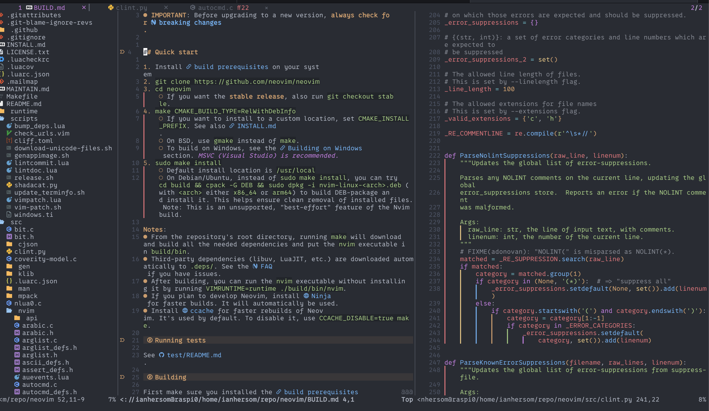

# 🕹️ Remote SSH

Adds seamless support for working with remote files in Neovim via SSH, SCP, or rsync protocols, with integrated Language Server Protocol (LSP) and TreeSitter support. This plugin handles the complexities of connecting remote language servers with your local Neovim instance, allowing you to work with remote projects as if they were local.

> [!NOTE]
> This plugin takes a unique approach by running language servers on the remote machine while keeping the editing experience completely local. This gives you full LSP features without needing to install language servers locally.

## 🔄 How it works

This plugin takes a unique approach to remote development, given the currently available remote neovim plugins:

```
┌─────────────┐    SSH     ┌──────────────┐
│   Neovim    │◄──────────►│ Remote Host  │
│  (Local)    │            │              │
│             │            │ ┌──────────┐ │
│ ┌─────────┐ │            │ │Language  │ │
│ │ LSP     │ │            │ │Server    │ │
│ │ Client  │ │            │ │          │ │
│ └─────────┘ │            │ │          │ │
└─────────────┘            │ └──────────┘ │
                           └──────────────┘
```

1. Opens a "Remote Buffer" - i.e. reads a remote file into a local buffer
2. It launches language servers **directly on the remote machine**
3. A Python proxy script handles communication between Neovim and the remote language servers
4. The plugin automatically translates file paths between local and remote formats
5. File operations happen asynchronously to prevent UI freezing
6. TreeSitter is automatically enabled for remote file buffers to provide syntax highlighting

This approach gives you full LSP functionality without network latency affecting editing operations.

## 🚀 Quick Start

1. Install the plugin and restart Neovim
2. Open a remote file directly: `:RemoteOpen rsync://user@host//path/to_folder/file.cpp`
    - Or use `:RemoteTreeBrowser rsync://user@host//path/to_folder/`
        - This opens a file browser with browsable remote contents
3. LSP features will automatically work in most cases once the file opens

That's it! The plugin handles the rest automatically.



## ✨ Features

- **Seamless LSP integration** - Code completion, goto definition, documentation, and other LSP features work transparently with remote files
- **TreeSitter support** - Syntax highlighting via TreeSitter works for remote files
- **Asynchronous file operations** - Remote files are saved and fetched in the background without blocking your editor
- **Multiple language server support** - Ready-to-use configurations for popular language servers:

| Language Server                 | Current support      |
| --------------------------------| ---------------------|
| C/C++ (clangd)                  | _Fully supported_ ✅ |
| Zig (zls)                       | _Not tested_ 🟡      |
| Lua (lua_ls)                    | _Fully supported_ ✅ |
| Rust (rust-analyzer)            |  _Not supported_  ❌ |
| JavaScript/TypeScript(tsserver) | _Not tested_ 🟡      |
| Go (gopls)                      | _Not tested_ 🟡      |
| XML (lemminx)                   | _Fully supported_ ✅ |
| CMake (cmake)                   | _Fully supported_ ✅ |
| Python (pylsp)                  | _Fully supported_ ✅ |
| Python (pyright)                |  _Not supported_  ❌ |
| Bash (bashls)                   |  _Not supported_  ❌ |

- **Automatic server management** - Language servers are automatically started on the remote machine
- **Smart path handling** - Handles path translations between local and remote file systems
- **Robust error handling** - Graceful recovery for network hiccups and connection issues
- **Remote file browsing** - Browse remote directories with tree-based file explorer

## 📜 Requirements

### Local machine 💻

- Neovim >= 0.7.0
- [nvim-lspconfig](https://github.com/neovim/nvim-lspconfig)
- OpenSSH client
- Python 3

### Remote machine ☁️

- SSH server
- Language servers for your programming languages
- Python 3

### 💻 Platform Support

| Platform | Support |
|----------|----------|
| Linux    | ✅ Full |
| macOS    | ✅ Full |
| Windows  | 🟡 WSL recommended |

## 📥 Installation

Using [lazy.nvim](https://github.com/folke/lazy.nvim)

```lua
{
  "inhesrom/remote-ssh.nvim",
  dependencies = {
    "neovim/nvim-lspconfig",         -- Required for LSP configuration
    "nvim-telescope/telescope.nvim", -- Dependency for some remote buffer telescope actions
    "nvim-lua/plenary.nvim",
  },
  config = function()
    require('remote-ssh').setup({
      -- Your configuration here
    })
  end
}
```

Using [packer.nvim](https://github.com/wbthomason/packer.nvim)

```lua
use {
  'inhesrom/remote-ssh.nvim',
  requires = {'neovim/nvim-lspconfig', "nvim-telescope/telescope.nvim"},
  config = function()
    require('remote-ssh').setup({
      -- Your configuration here
    })
  end
}
```


## ⚙️ Configuration

Here's a default configuration with comments explaining each option:

```lua
require('remote-ssh').setup({
  -- Optional: Custom on_attach function for LSP clients
  on_attach = function(client, bufnr)
    -- Your LSP keybindings and setup
  end,

  -- Optional: Custom capabilities for LSP clients
  capabilities = vim.lsp.protocol.make_client_capabilities(),

  -- Custom mapping from filetype to LSP server name
  filetype_to_server = {
    -- Example: Use pylsp for Python (default and recommended)
    python = "pylsp",
    -- More customizations...
  },

  -- Custom server configurations
  server_configs = {
    -- Custom config for clangd
    clangd = {
      filetypes = { "c", "cpp", "objc", "objcpp" },
      root_patterns = { ".git", "compile_commands.json" },
      init_options = {
        usePlaceholders = true,
        completeUnimported = true
      }
    },
    -- More server configs...
  },

  -- Async write configuration
  async_write_opts = {
    timeout = 30,         -- Timeout in seconds for write operations
    debug = false,        -- Enable debug logging
    log_level = vim.log.levels.INFO
  }
})
```

## 🎥 Examples

### Opening and editing remote files

```bash
# In your terminal
nvim rsync://user@remote-host/path/to/file.cpp
```

Or from within Neovim:

```vim
:e rsync://user@remote-host/path/to/file.cpp
```

### Using the RemoteOpen command

```vim
:RemoteOpen rsync://user@remote-host/path/to/file.cpp
```

### Browsing remote directories

```vim
:RemoteTreeBrowse rsync://user@remote-host/path/to/directory
```

## 🤖 Available commands

| Primary Commands          | What does it do?                                                            |
| ------------------------- | --------------------------------------------------------------------------- |
| `:RemoteOpen`             | Open a remote file with scp:// or rsync:// protocol                         |
| `:RemoteTreeBrowse`       | Browse a remote directory with tree-based file explorer                     |
| `:RemoteGrep`             | Search for text in remote files using grep                                  |
| `:RemoteRefresh`          | Refresh a remote buffer by re-fetching its content                          |
| `:RemoteRefreshAll`       | Refresh all remote buffers                                                  |

| Debug Commands            | What does it do?                                                            |
| ------------------------- | --------------------------------------------------------------------------- |
| `:RemoteLspStart`         | Manually start LSP for the current remote buffer                            |
| `:RemoteLspStop`          | Stop all remote LSP servers and kill remote processes                       |
| `:RemoteLspRestart`       | Restart LSP server for the current buffer                                   |
| `:RemoteLspSetRoot`       | Set the root directory for the remote LSP server                            |
| `:RemoteLspServers`       | List available remote LSP servers                                           |
| `:RemoteLspDebug`         | Print debug information about remote LSP clients                            |
| `:RemoteLspDebugTraffic`  | Enable/disable LSP traffic debugging                                        |
| `:RemoteFileStatus`       | Show status of remote file operations                                       |
| `:AsyncWriteCancel`       | Cancel ongoing asynchronous write operation                                 |
| `:AsyncWriteStatus`       | Show status of active asynchronous write operations                         |
| `:AsyncWriteForceComplete`| Force complete a stuck write operation                                      |
| `:AsyncWriteDebug`        | Toggle debugging for async write operations                                 |
| `:AsyncWriteLogLevel`     | Set the logging level (DEBUG, INFO, WARN, ERROR)                            |
| `:AsyncWriteReregister`   | Reregister buffer-specific autocommands for current buffer                  |
| `:TSRemoteHighlight`      | Manually enable TreeSitter highlighting for remote buffers                  |

## ⚠️ Caveats

- Language servers must be installed on the remote machine
- SSH access to the remote machine is required
- Performance depends on network connection quality
- For very large projects, initial LSP startup may take longer

## 📝 Tips for best experience

1. **SSH Config**: Using SSH config file entries can simplify working with remote hosts
2. **Language Servers**: Ensure language servers are properly installed on remote systems
3. **Project Structure**: For best results, work with proper project structures that language servers can recognize
4. **Network**: A stable network connection improves the overall experience

## FAQ

### Why use this plugin instead of just mounting remote directories locally?

While mounting remote directories (via SSHFS, etc.) is a valid approach, it has several drawbacks:
- Network latency affects every file operation
- Syncing large projects can be time-consuming
- Language servers running locally might not have access to the full project context

This plugin runs language servers directly on the remote machine where your code lives, providing a more responsive experience with full access to project context.

### How does this differ from Neovim's built-in remote file editing?

Neovim's built-in remote file editing doesn't provide LSP support. This plugin extends the built-in functionality by:
1. Enabling LSP features for remote files
2. Providing asynchronous file saving
3. Handling the complexities of remote path translation for LSP
4. Adding TreeSitter support for syntax highlighting
5. Providing commands for browsing and searching remote directories

## 🤝 Contributing

Contributions are welcome! Please read [CONTRIBUTING.md](CONTRIBUTING.md) for guidelines.

- Report bugs via GitHub Issues
- Submit feature requests
- Contribute code via Pull Requests
- Improve documentation

## Buy Me a Coffee
If you feel so inclined, out of appreciation for this work, send a coffee my way!
[Buy Me a Coffee Link](https://coff.ee/inhesrom)

## 📄 License

This project is licensed under the MIT License - see the [LICENSE](LICENSE) file for details.
